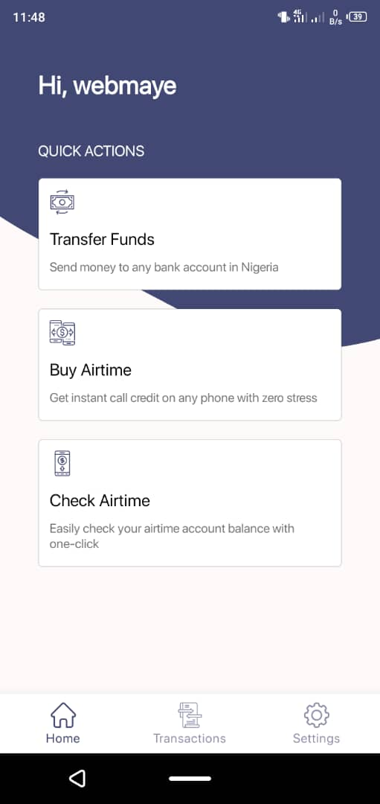
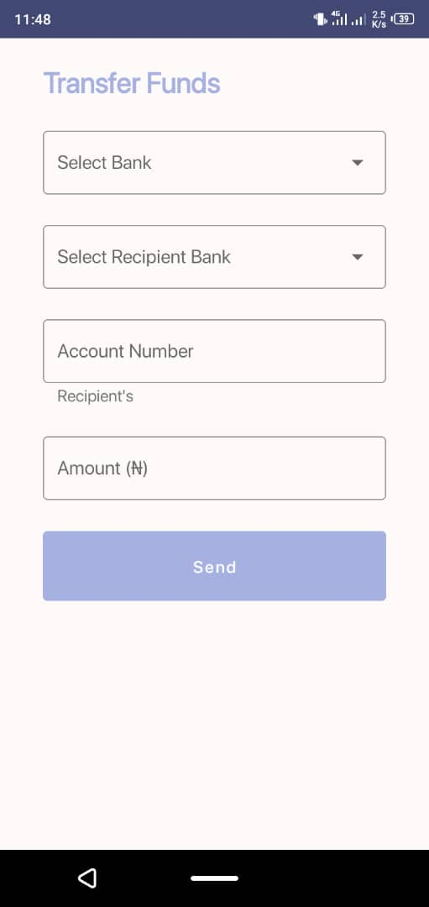
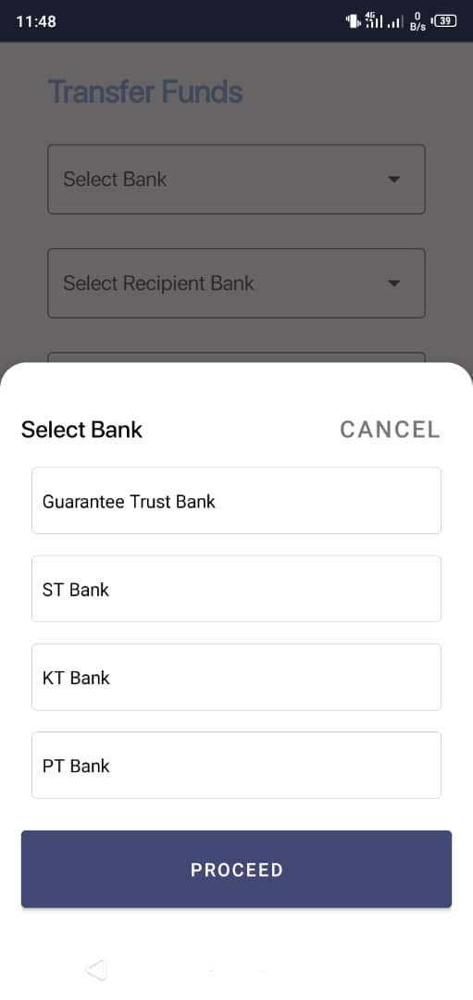
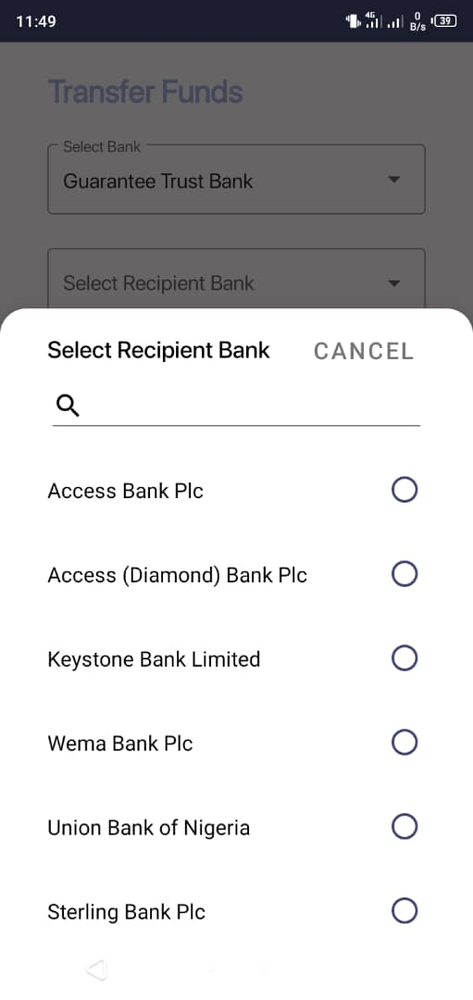
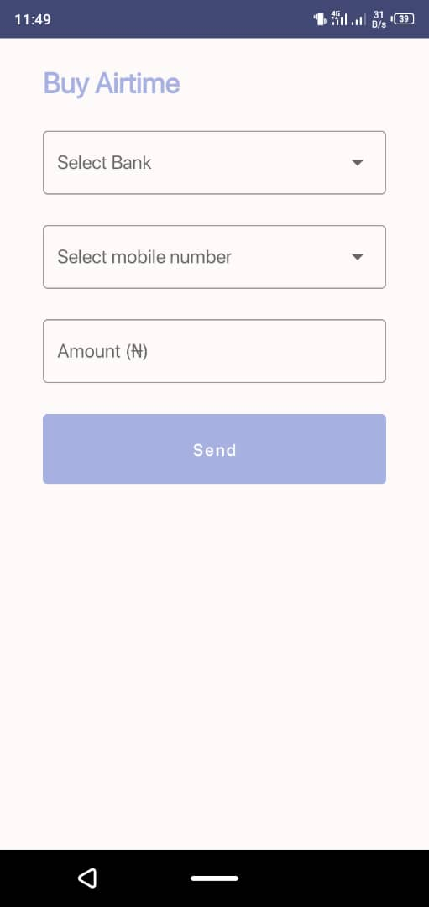
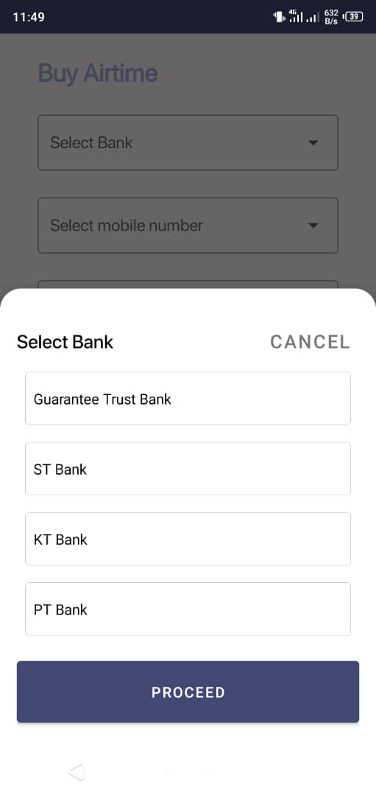
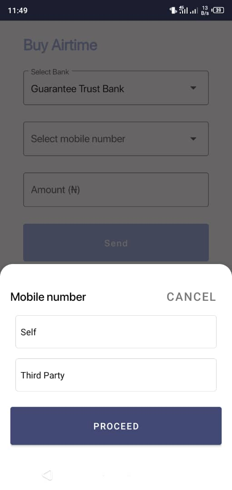
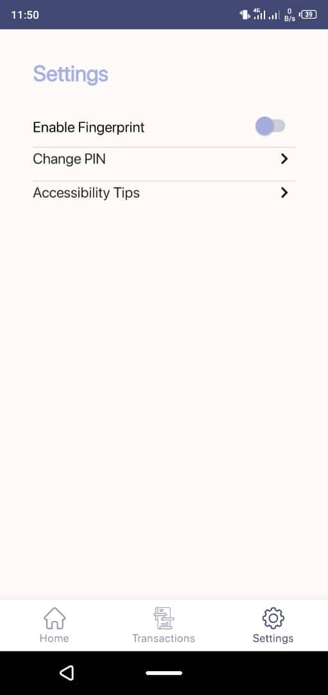
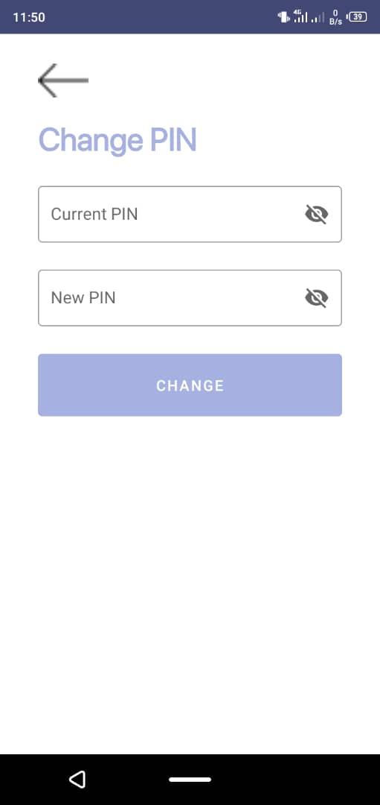
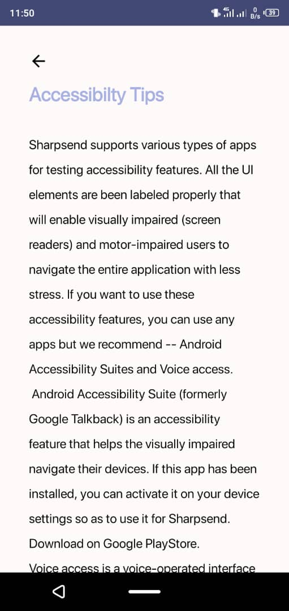

# Sharpsend

**Hello, and welcome to Sharpsend**

  Sharpsend is a mobile platform that enables anyone to perform financial operations completely offline. 
  You can send money to any bank account in Nigeria, get instant call credit on any phone number with zero stress, 
  and easily check airtime account balance with one-click of a button. All of this won't have been possible without the use of the 
  SDK provided to us by the amazing folks at Hover, which essentially allows us to perform these USSD operations seamlessly.
  
**Get Started**

  To get started, create a profile on Sharpsend by setting a new username and 4 digits PIN. The PIN will also be needed
  when you want to login. You can also log in with your biometric credentials if you have enabled it in the settings screen. Keep in mind
  that the biometrics authentication would only be enabled if it is supported by the phone itself.
  
  
  
### Transfer Funds

To transfer money on Sharpsend, you will do the following; 

- Select your personal bank (we only support GT Bank and Stanbic IBTC for now).
- Select the recipient bank.
- Input the recipient account number.
- Enter the amount you want to send, and click ''Send''.

     

### Buy Airtime

To buy airtime on Sharpsend, you will do the following;

- Select your personal bank.
- Choose whether you want to buy airtime for yourself or 3rd party (another person).
- Input the recipient phone number.
- Enter the amount of airtime you want to send and click ''Done''.

     

### Check Airtime

To buy airtime on Sharpsend, click on the buy airtime quick action and it will automatically display your airtime balance based on the mobile phone number registered with your bank account.

### Transaction History

The transaction history screen shows a list of all the transactions carried out on a user's account on Sharpsend which includes the type of operations performed whether its transfer to bank or airtime purchased along with their timestamps respectively.

### Settings

On the settings screen, you can change your PIN if you have forgotten it, you can enable the fingerprint lock for top-level security which will ask for your biometric credentials if you want to login. 

It also contains accessibility tips on how to use Sharpsend for disabled folks.

     

Best Regards,

The Goteam.
